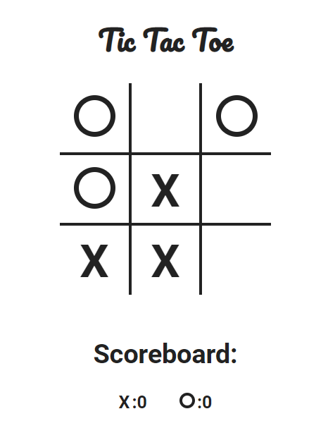

<h5 align="center">
<br>
 <b>Tic Tac Toe - We Tied, shit!</b> :older_woman:
</h5>
<p align="center">
  <a href="https://www.udemy.com/course/javascript-do-basico-ao-avancado-com-node-e-projetos/">
    
  </a>
  
</p>

<br/>

## :eyeglasses: How was it?

<hr/>

<hr/>


## :star2: Technologies
This project was built with pure JavaScript.

## 📖 About this project
This project is a simple casual game made with JS to pratice all basic fundamentals of the language, DOM manipulation and syntax.
Made with during the course [JavaScript do básico ao avançado (c/ Node.js e projetos)](https://www.udemy.com/course/javascript-do-basico-ao-avancado-com-node-e-projetos/) under orientation or the instructor [Matheus Battisti](https://www.linkedin.com/in/matheusbattisti/).

## :seedling: How to contribute
 - Fork this repository;
 - Create a branch with your feature: ```git checkout -b my-feature```
 - Commit your changes: ```git commit -m 'feat: My new feature'```
 - Push your branch: ```git push origin my-feature```

## :memo: License
This project is under the MIT license. Take a look at the [LICENSE](LICENSE.md) file for more details.


